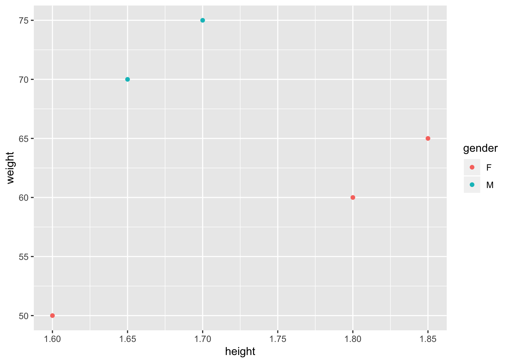
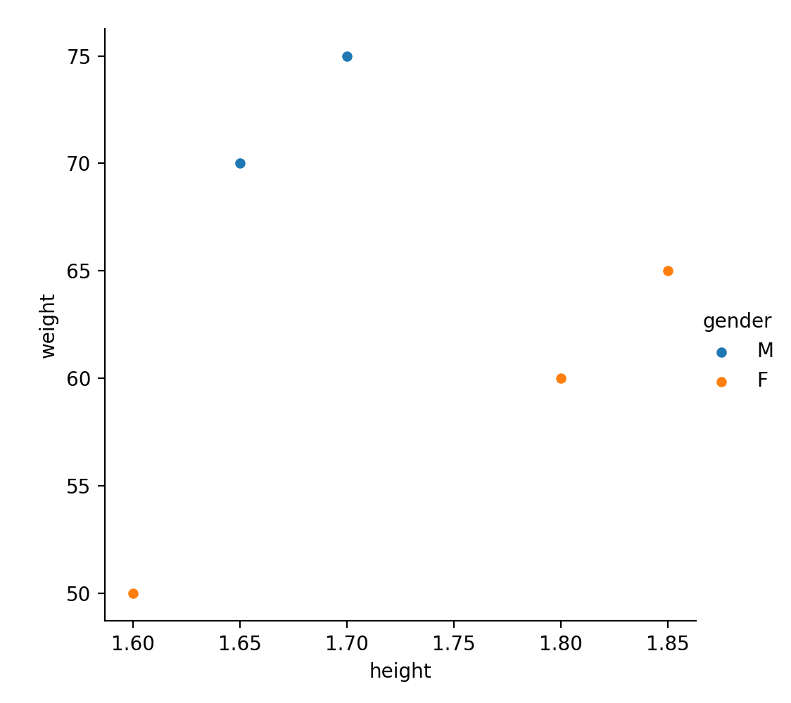

R/Python Cheatsheet
================

## Data Structures

### R

R offers quite a few data structures in base-R:

  - Vector
  - Matrix
  - List
  - Data frame

#### Vector in R

A vector is a collection of same type of elements and could assume any
of the following types:

  - character
  - logical
  - integer
  - numeric

A vector is used to apply mathemathical techniques like vector algebra
and are quite often used to implement mathematical and statistical
procedures. <br>

``` r
# Create a vector (numeric)
vec_1 <- c(2,  3,  5,  7)
vec_2 <- c(3,  5,  1,  4)

# Vector one
print(vec_1)
```

    ## [1] 2 3 5 7

``` r
# Vector two
print(vec_2)
```

    ## [1] 3 5 1 4

``` r
# Vector Addition
print(vec_1 + vec_2)
```

    ## [1]  5  8  6 11

Notice that the addition of two numeric vectors is the sum of individual
numeric elements of each vector at the corresponding index. <br>

#### Matrix in R

Matrices are an extension of numeric or character vector. They are
similar to vector in the sense that they also store same data type
elements but matrices has dimensions and vectors have only one
dimension. They are useful in implementing the matrix algebra. They are
commonly used for linear transformations. Below code creates a 2
dimensional matrix containing 2 rows and 2 columns. <br>

``` r
# Create a matrix
mtrx_1 <- matrix(vec_1,  nrow = 2,  ncol = 2)
mtrx_2 <- matrix(vec_2,  nrow = 2,  ncol = 2)

# Matrix one
print(mtrx_1)
```

    ##      [,1] [,2]
    ## [1,]    2    5
    ## [2,]    3    7

``` r
# Matrix one
print(mtrx_2)
```

    ##      [,1] [,2]
    ## [1,]    3    1
    ## [2,]    5    4

``` r
# Matrix Addition
print(mtrx_1 + mtrx_2)
```

    ##      [,1] [,2]
    ## [1,]    5    6
    ## [2,]    8   11

Notice that the addition of two matrices is the sum of individual
numeric elements of each matrix at the corresponding 2 dimensional
index. <br>

#### List in R

Lists are similar to vector in a way that they are collection of
elements, but with a difference that the elements can be a mixture of
different data types. They are helpful when we need to bind together
mulitple objects, to pass them as arguments to functions or when we need
to return multiple objects from the functions. <br>

``` r
# Create a mixed data type list
list_1 <- list(0,  "j",  TRUE,  1 + 4i)
print(list_1)
```

    ## [[1]]
    ## [1] 0
    ## 
    ## [[2]]
    ## [1] "j"
    ## 
    ## [[3]]
    ## [1] TRUE
    ## 
    ## [[4]]
    ## [1] 1+4i

``` r
# Create a character vector
names_vec <- c("Jon",  "Jane",  "John",  "Jean")

# Create a named list of two vectors of different data types
list_2 <- list(id = vec_1,  name = names_vec)
print(list_2)
```

    ## $id
    ## [1] 2 3 5 7
    ## 
    ## $name
    ## [1] "Jon"  "Jane" "John" "Jean"

#### Data-frame in R

A data frame is a tabular data structure in R and is the most commonly
used data structure. It can be thought of as a rectangular list in which
data is structured in rows and columns. It is infact a special type of
list. For most of the statistical analysis, R datasets are created as
data-frame. <br>

``` r
# Create a data.frame
customers_df <- data.frame(id = vec_1,  name = names_vec)

# Print top 2 records
head(customers_df,  2)
```

    ##   id name
    ## 1  2  Jon
    ## 2  3 Jane

#### Data-table in R

A data-table is essentially a data-frame but with added features. A
data-frame is part of base R, while data-table was developed as an
extension of data-frame. The key additional features built into
data-table are speed of access and a cleaner syntax. <br>

``` r
# Create a data.table
customers_dt <- data.table(id = vec_1,  name = names_vec)

# Print top 2 records
head(customers_dt,  2)
```

    ##    id name
    ## 1:  2  Jon
    ## 2:  3 Jane

### Python

Python offers similar data structures as R. Python programming language
has basically four types of built-in data structures:

  - **List** is a collection which is ordered and changeable. Allows
    duplicate members.
  - **Tuple** is a collection which is ordered and unchangeable. Allows
    duplicate members.
  - **Set** is a collection which is unordered and unindexed. No
    duplicate members.
  - **Dictionary** is a collection which is unordered, changeable and
    indexed. No duplicate members.

#### Vector in Python

**numpy** is a python library built specifically for large,
multi-dimensionals arrays and matrices. It has large collection
functions specially built for mathematical operations. A vector in
Python is basically a one dimensional **numpy** array. Operations on
vectors are pretty much similar to R. <br>

``` python
import numpy as np
# Create a vector (numeric)
vec_1 = np.array([2,  3,  5,  7])
vec_2 = np.array([3,  5,  1,  4])

# Vector one
print(vec_1)

# Vector two
```

    ## [2 3 5 7]

``` python
print(vec_2)

# Vector Addition
```

    ## [3 5 1 4]

``` python
print(vec_1 + vec_2)
```

    ## [ 5  8  6 11]

#### Matrix in Python

A matrix in Python is basically a multi-dimensional **numpy** array.
Operations on matrices are pretty much similar to R. In the below
example, the first matrix is created from a 1-dimensional array reshaped
into a 2-dimensional array. To align with the R code, matrix transpose
has been used. It’s just because the Python default reshapes the 1-d
array row-wise while R reshapes the 1-d array column-wise. R’s default
reshaping can be changed to row-wise as well. In this case, we have just
taken the transpose of the 2x2 array to match with R version of the
code. <br>

``` python
import numpy as np
# Create a matrix
mtrx_1 = np.array([2,  3,  5,  7])
mtrx_1 = mtrx_1.reshape(2, 2)
mtrx_1 = mtrx_1.T

# Matrix one
print(mtrx_1)
```

    ## [[2 5]
    ##  [3 7]]

``` python
mtrx_2 = np.array([[3,  5], [1,  4]])
mtrx_2 = mtrx_2.T

# Matrix two
print(mtrx_2)

# Matrix Addition
```

    ## [[3 1]
    ##  [5 4]]

``` python
print(mtrx_1 + mtrx_2)
```

    ## [[ 5  6]
    ##  [ 8 11]]

#### List in Python

Lists in Python are similar to R except that the named lists in Python
are actually called ‘dictionary’ type data structures. Dictionary does
not allows duplicate members in Python while a list allows duplicates in
both Python and R. <br>

``` python
# Create a mixed data type list
list_1 = [0,  "j",  True,  1 + 4j]
print(list_1)

# Create a list of list
```

    ## [0, 'j', True, (1+4j)]

``` python
id = [2,  3,  5,  7]
names = ["Jon",  "Jane",  "John",  "Jean"]
list_2 = [id, names]
print(list_2)
```

    ## [[2, 3, 5, 7], ['Jon', 'Jane', 'John', 'Jean']]

#### Data-frame in Python

**pandas** is a very popular Python library written for data
manipulation and analysis. It provides a similar data structure like R
data frame with built in indexation. It provides various functions for
data manipulation, reshaping, slicing, grouping, merging, time-series
and lot more. **pandas** dataframes can be initialized using a
dictionary type object. <br>

``` python
import numpy as np
import pandas as pd
# Create a dictonary (Named List)
customers_dct = {
        "id":id, 
        "name":names
    }
    
# Print dictionary
print(customers_dct)

# Data Frame
```

    ## {'id': [2, 3, 5, 7], 'name': ['Jon', 'Jane', 'John', 'Jean']}

``` python
customers_df = pd.DataFrame(customers_dct)

# Print top 2 records
customers_df.head(2)
```

    ##    id  name
    ## 0   2   Jon
    ## 1   3  Jane

## Data Import and Export

Loading a dataset from a locally or remotely stored file into memory is
the most common data science task. Similarly, often an analyst need to
store the analytical outputs from memory to a local or remote storage
location.

### R

Example below saves the customer details dataset, created earlier, to a
file on a local disk. The code ensures that the local directory exists
before writing the contents of data.table to a file. ‘fwrite’ is a
function from **data.table** library which provides a fast function to
write large data.tables to disk. ‘fread’ is a similar fast function to
read large files, stored on a disk, into the memory. <br>

``` r
# Check if directory exists,  if not,  create one
output_dir <- file.path(getwd(),  "Data")

if (!dir.exists(output_dir)){
  dir.create(output_dir)
} else {
  print("Dir already exists!")
}
```

    ## [1] "Dir already exists!"

``` r
#Write
fwrite(customers_dt, "Data/employees.csv")

#Read
customers_dt <- fread("Data/employees.csv")

#Print top 2 records 
head(customers_dt,  2)
```

    ##    id name
    ## 1:  2  Jon
    ## 2:  3 Jane

### Python

Similar to R, **pandas** has a method ‘to\_csv’ to write the data-frame
contents to a csv file on disk. ‘read\_csv’ is used to import data from
disk into memory. Note that the name of the imported dataframe has been
suffixed with ‘dt’ just to be in sync with R data.table naming
convention of a data.table object. It is essentially a **pandas**
dataframe denoted by ‘dt’ suffixed name. <br>

``` python
import os
import pandas as pd
# Check if directory exists,  if not,  create one
output_dir = os.getcwd() + "/Data"
if not os.path.exists(output_dir):
    os.makedirs(output_dir)
else:
    print("Dir already exists!")

#Write
```

    ## Dir already exists!

``` python
customers_df.to_csv("Data/employees.csv",  index=False)

#Read
customers_dt = pd.read_csv("Data/employees.csv") 

#Print top 2 records
customers_dt.head(2)
```

    ##    id  name
    ## 0   2   Jon
    ## 1   3  Jane

<br>

## Data Binding

Some of the data science tasks requires calculations that end up
generating additional information that needs to be appended/binded to
the original dataset. Example, a function generates a list calculated
from one or more columns from the original dataset. The returned list
needs to be appended back to the original dataset. Another example could
be aggregating numbers across multiple datasets of same shape, in which
case you will bind all of them togethers rows by rows.

### R

‘cbind’ is a function in base R to bind together datasets by column.
‘rbind’ is a function in base R to bind together datasets by rows.
Example below adds additional information about customer, ‘age’ and
‘height’ of customer. Also, another customer is added as a new row to
the original customer data.table.

<br>

``` r
# Data Binding

#Print top 2 records
head(customers_dt,2)
```

    ##    id name
    ## 1:  2  Jon
    ## 2:  3 Jane

``` r
# Bind new columns
age <- c(30,  25,  35,  29)
customers_dt <- cbind(customers_dt,  age)

height <- c(1.7,  1.8,  1.65,  1.85)
customers_dt <- cbind(customers_dt,  height)

#Print top 2 records
head(customers_dt,2)
```

    ##    id name age height
    ## 1:  2  Jon  30    1.7
    ## 2:  3 Jane  25    1.8

``` r
# Bind new rows
# new row is defined as a new data.table
new_row <- data.table(id = 9,  name = "Jen",  age = 31,  height = 1.6)

# Must be of same shape
customers_dt <- rbind(customers_dt,  new_row)

#Print all records
print(customers_dt)
```

    ##    id name age height
    ## 1:  2  Jon  30   1.70
    ## 2:  3 Jane  25   1.80
    ## 3:  5 John  35   1.65
    ## 4:  7 Jean  29   1.85
    ## 5:  9  Jen  31   1.60

### Python

In Python, the assignment operator binds new columns and name of the new
column is specified by the name enclosed in the square brackets of the
**pandas** dataframe. If the column with the same name already exists,
then the column gets updated otherwise it gets created. Adding a new row
can be done using ‘concat’ funtion of **pandas** library. <br>

``` python
import pandas as pd

#Print top 2 records
customers_dt.head(2)

# Bind new columns
```

    ##    id  name
    ## 0   2   Jon
    ## 1   3  Jane

``` python
age = [30,  25,  35,  29]
customers_dt["age"] = age

height = [1.7,  1.8,  1.65,  1.85]
customers_dt["height"] = height

#Print top 2 records
customers_dt.head(2)

# Bind new rows
# new row is defined as a dict first (each item as a list) and then as pandas dataframe
```

    ##    id  name  age  height
    ## 0   2   Jon   30     1.7
    ## 1   3  Jane   25     1.8

``` python
new_row = {
        "id":[9], 
        "name":["Jen"], 
        "age":[31], 
        "height":[1.6]
    }
    
customers_dt = pd.concat([customers_dt,  pd.DataFrame(new_row)],  ignore_index=True)

#Print all records
print(customers_dt)
```

    ##    id  name  age  height
    ## 0   2   Jon   30    1.70
    ## 1   3  Jane   25    1.80
    ## 2   5  John   35    1.65
    ## 3   7  Jean   29    1.85
    ## 4   9   Jen   31    1.60

## Data Wrangling

Data wrangling includes a variety of commonly performed data science
tasks such as cleansing, standardizing, augmenting and are often applied
on rows, columns, subset of rows and columns etc.

### R

The very first task is to look at the shape, size, data types and
distribution of data in the dataset under investigation. Below examples
show how to look at the some of the descriptive statistics of dataset,
removing NAs, removing duplicates, subsetting data by rows & columns,
aggregating data. ‘summary’ function proivdes basic stastics about the
data types and distribution of data. ‘is.na’ checks for any NAs in the
data. ‘unique’ returns the dataset by removing row level duplicates
across all columns.Rows can be subset by using indexes of the datatable
or by specifying a condition as ‘i’ of the data.table\[i,j,by\]. ‘’i’ is
basically telling the data.table to filter records by the specified
condition (like a WHERE clause in SQL), ‘j’ tell data.table what columns
to select or what functions to apply on the selected columns, ‘by’ is
used to group together columns to calculate aggregate functions. Example
below shows how to count all customers whose weight is greater than 60
grouped into males/female and order by descending count of customers.
<br>

``` r
# Data Wrangling

## Descriptive statistics
summary(customers_dt)
```

    ##        id          name                age         height    
    ##  Min.   :2.0   Length:5           Min.   :25   Min.   :1.60  
    ##  1st Qu.:3.0   Class :character   1st Qu.:29   1st Qu.:1.65  
    ##  Median :5.0   Mode  :character   Median :30   Median :1.70  
    ##  Mean   :5.2                      Mean   :30   Mean   :1.72  
    ##  3rd Qu.:7.0                      3rd Qu.:31   3rd Qu.:1.80  
    ##  Max.   :9.0                      Max.   :35   Max.   :1.85

``` r
## Removing NULLS
customers_dt[!is.na(name)]
```

    ##    id name age height
    ## 1:  2  Jon  30   1.70
    ## 2:  3 Jane  25   1.80
    ## 3:  5 John  35   1.65
    ## 4:  7 Jean  29   1.85
    ## 5:  9  Jen  31   1.60

``` r
## Removing Duplicates
# Add a duplicate
customers_dt <- rbind(customers_dt,  new_row)
customers_dt
```

    ##    id name age height
    ## 1:  2  Jon  30   1.70
    ## 2:  3 Jane  25   1.80
    ## 3:  5 John  35   1.65
    ## 4:  7 Jean  29   1.85
    ## 5:  9  Jen  31   1.60
    ## 6:  9  Jen  31   1.60

``` r
# Remove the duplicate
customers_dt <- unique(customers_dt)
customers_dt
```

    ##    id name age height
    ## 1:  2  Jon  30   1.70
    ## 2:  3 Jane  25   1.80
    ## 3:  5 John  35   1.65
    ## 4:  7 Jean  29   1.85
    ## 5:  9  Jen  31   1.60

``` r
## Select rows/columns
### Rows
customers_dt[1:2, ]
```

    ##    id name age height
    ## 1:  2  Jon  30    1.7
    ## 2:  3 Jane  25    1.8

``` r
customers_dt[name=="Jon", ]
```

    ##    id name age height
    ## 1:  2  Jon  30    1.7

``` r
### Columns
customers_dt[, 1:2]
```

    ##    id name
    ## 1:  2  Jon
    ## 2:  3 Jane
    ## 3:  5 John
    ## 4:  7 Jean
    ## 5:  9  Jen

``` r
customers_dt[, .(name,  id)]
```

    ##    name id
    ## 1:  Jon  2
    ## 2: Jane  3
    ## 3: John  5
    ## 4: Jean  7
    ## 5:  Jen  9

``` r
### Rows & Columns
customers_dt[name=="Jon", .(name,  id)]
```

    ##    name id
    ## 1:  Jon  2

``` r
## Aggregate by group and order the resulting output
weight <- c(75, 60, 70, 65, 50)
customers_dt <- cbind(customers_dt,  weight)

gender <- c("M", "F", "M", "F", "F")
customers_dt <- cbind(customers_dt,  gender)

customers_dt[weight>60,  .N,  by =  gender][order(-N)]
```

    ##    gender N
    ## 1:      M 2
    ## 2:      F 1

### Python

In Python, ‘describe’ function provides a nice summary statistics about
the data. ‘isnull’ is used to check nulls. ~ is the **not** operator in
**pandas** whereas \! is the equivalent in R. ‘drop\_duplicates’ is the
method to eliminate row-wise duplicates across all columns. ‘iloc’
method is to subset rows/columns using index. ‘value\_counts’ is a
method to aggregate counts across the selected columns. In the example
below it counts all the customers whose weight is greater than 60
grouped into males/female and order by descending count of customers.
<br>

``` python
import pandas as pd
# Data Wrangling

## Descriptive statistics
customers_dt.describe(include = "all")

## Removing NULLS
```

    ##               id name        age    height
    ## count   5.000000    5   5.000000  5.000000
    ## unique       NaN    5        NaN       NaN
    ## top          NaN  Jon        NaN       NaN
    ## freq         NaN    1        NaN       NaN
    ## mean    5.200000  NaN  30.000000  1.720000
    ## std     2.863564  NaN   3.605551  0.103682
    ## min     2.000000  NaN  25.000000  1.600000
    ## 25%     3.000000  NaN  29.000000  1.650000
    ## 50%     5.000000  NaN  30.000000  1.700000
    ## 75%     7.000000  NaN  31.000000  1.800000
    ## max     9.000000  NaN  35.000000  1.850000

``` python
customers_dt[~customers_dt["name"].isnull()]
```

    ##    id  name  age  height
    ## 0   2   Jon   30    1.70
    ## 1   3  Jane   25    1.80
    ## 2   5  John   35    1.65
    ## 3   7  Jean   29    1.85
    ## 4   9   Jen   31    1.60

``` python
customers_dt.isnull().values.any()

## Removing Duplicates
# Add a duplicate
```

    ## False

``` python
customers_dt = pd.concat([customers_dt,  pd.DataFrame(new_row)],  ignore_index=True)
customers_dt

# Drop duplicate
```

    ##    id  name  age  height
    ## 0   2   Jon   30    1.70
    ## 1   3  Jane   25    1.80
    ## 2   5  John   35    1.65
    ## 3   7  Jean   29    1.85
    ## 4   9   Jen   31    1.60
    ## 5   9   Jen   31    1.60

``` python
customers_dt = customers_dt.drop_duplicates()
customers_dt

## Select rows/columns
### Rows
```

    ##    id  name  age  height
    ## 0   2   Jon   30    1.70
    ## 1   3  Jane   25    1.80
    ## 2   5  John   35    1.65
    ## 3   7  Jean   29    1.85
    ## 4   9   Jen   31    1.60

``` python
customers_dt.iloc[0:2]
```

    ##    id  name  age  height
    ## 0   2   Jon   30     1.7
    ## 1   3  Jane   25     1.8

``` python
customers_dt[customers_dt["name"]=="Jon"]

### Columns
```

    ##    id name  age  height
    ## 0   2  Jon   30     1.7

``` python
customers_dt.iloc[:, 0:2]
```

    ##    id  name
    ## 0   2   Jon
    ## 1   3  Jane
    ## 2   5  John
    ## 3   7  Jean
    ## 4   9   Jen

``` python
customers_dt[["name", "id"]]

### Rows & Columns
```

    ##    name  id
    ## 0   Jon   2
    ## 1  Jane   3
    ## 2  John   5
    ## 3  Jean   7
    ## 4   Jen   9

``` python
customers_dt.loc[customers_dt["name"]=="Jon",  ["name", "id"]]

## Where clause
## group by
## order by
```

    ##   name  id
    ## 0  Jon   2

``` python
weight = [75, 60, 70, 65, 50]
customers_dt["weight"] = weight
```

    ## /Users/anuj/.virtualenvs/cs_proj/bin/python:1: SettingWithCopyWarning: 
    ## A value is trying to be set on a copy of a slice from a DataFrame.
    ## Try using .loc[row_indexer,col_indexer] = value instead
    ## 
    ## See the caveats in the documentation: http://pandas.pydata.org/pandas-docs/stable/indexing.html#indexing-view-versus-copy

``` python
gender = ["M", "F", "M", "F", "F"]
customers_dt["gender"] = gender

# Default sorts on frequencies and order in descending
customers_dt.loc[customers_dt["weight"]>60, "gender"].value_counts()
```

    ## M    2
    ## F    1
    ## Name: gender, dtype: int64

## Data Transformation

This section specifically talks about transforming and reshaping the
data to compute additional features or to convert it into more
meaningful shape to perform analytical functions. Some complex datasets
come in multi-dimensions and does not necessary confirm to the
rectangular structure of row and columns. In such cases, the dataset is
reshaped in such a way that single subjects information is stored in
multiple rows to perform some meaningful analysis.

### R

Examples below show how to transform a column from one scale to another
and store as an additional information. ‘melt’ is a function from
**data.table** library to reshape/transpose the data from a wide format
to a long format. In the example, the wide format variable ‘id’, ‘age’,
‘height’, ‘weight’ are collapsed into a measure/value pair for each
‘id’, ‘name’ (subject). ‘dcast’ is the another function to convert a
long form data to a wide form data. <br>

``` r
# Data Transformation

# Convert height in metres to inches and save as another column
customers_dt[,  height_inch:=height*39.37]

# Drop a column
customers_dt[,  height_inch:= NULL]

# Long form
customers_dt_l <- melt(customers_dt, id.vars = c("id", "name"), measure.vars = c("id", "age", "height", "weight"))

# Print top 5 records
head(customers_dt_l, 5)
```

    ##    id name variable value
    ## 1:  2  Jon       id     2
    ## 2:  3 Jane       id     3
    ## 3:  5 John       id     5
    ## 4:  7 Jean       id     7
    ## 5:  9  Jen       id     9

``` r
# Wide form
customers_dt_w <- dcast(customers_dt_l, name ~ variable, value.var = "value")

# Print top 2 records
head(customers_dt_w, 2)
```

    ##    name id age height weight
    ## 1: Jane  3  25   1.80     60
    ## 2: Jean  7  29   1.85     65

### Python

‘del’ is a keyword in Python to delete objects. Example below shows how
to delete a column in **pandas** dataframe. ‘melt’ function in
**pandas** transpose the data from a wide form to a long form.
‘pivot\_table’ method does the opposite of melt and helps to transpose
data from long form to wide form. <br>

``` python
import pandas as pd

# Data Transformation

# Convert height in metres to inches and save as another column
customers_dt["height_inch"] = customers_dt["height"]*39.37

# Drop columns
del customers_dt["height_inch"]

# Long form
customers_dt_l = pd.melt(customers_dt,  id_vars=["name"],  value_vars=["id", "age", "height", "weight"])

# Print top 5 records
customers_dt_l.head(5)

# Wide form
```

    ##    name variable  value
    ## 0   Jon       id    2.0
    ## 1  Jane       id    3.0
    ## 2  John       id    5.0
    ## 3  Jean       id    7.0
    ## 4   Jen       id    9.0

``` python
customers_dt_w = customers_dt_l.pivot_table(values="value",  index="name",  columns="variable").reset_index()

# Print top 2 records
customers_dt_w.head(2)
```

    ## variable  name   age  height   id  weight
    ## 0         Jane  25.0    1.80  3.0    60.0
    ## 1         Jean  29.0    1.85  7.0    65.0

## Data Joins

Often an analyst needs to join two or more datasets to collate disparate
sets of information. Example, join customer transactions with the
customer’s demographic information to analyse the frequency of
transactions by a geographical region.

### R

**data.table** library in R provides a nice and easy way of joining two
datasets. One simply needs to set the keys (like SQL primary keys) on
the columns in both the tables on which one wants to join the two
datasets. In the example below, we have customers’ personal details in
one data.table and address details in another data.table. Now, we need
to enhance the customer’s personal details dataset with the location
information. Both the datasets have a common key called the
‘address\_id’. We set keys on both the data.tables and simply
enclose one data.table inside the square brackets of another data.table.
The position of data.table being on the right (inside the square
brackets) or left (outside the square brackets) is important as that is
the way to distinguish the type of join we want apply. A right outer
join (misnomer in this context) is a join where in the resulting joined
data.table contains all the rows from data.table that is enclosed within
the square bracket and all the matched rows of the data.table outside
the square brackets. In the example below of right join, all the rows of
address details will be in the resulting joined dataset whether or not
that matches with the customer details dataset rows and only the
matching rows from the customer details table. An inner join is a join
where the resulting joined dataset contains only the matching rows from
both the datasets. <br>

``` r
# Define addresses dataset
address_id <- c(1, 2, 3, 4, 5)
address_array <- c("1640 Riverside Drive,  Hill Valley,  California"
                   , "344 Clinton St.,  Apt. 3B,  Metropolis,  USA"
                   , "12 Grimmauld Place,  London,  UK"
                   , "221B Baker Street,  London,  UK"
                   , "1313 Webfoot Walk,  Duckburg,  Calisota")

address_dt <- data.table(address_id = address_id,  address = address_array)

# Set the address ids in the customer details dataset
address_id <- c(1, 2, 6, 5, 5)
customers_dt <- cbind(customers_dt,  address_id)

# Set the keys/columns to join on
setkey(customers_dt,  address_id)
setkey(address_dt,  address_id)

# Outer join (Right- All addresses + matching customers)
customers_dt[address_dt]
```

    ##    id name age height weight gender address_id
    ## 1:  2  Jon  30   1.70     75      M          1
    ## 2:  3 Jane  25   1.80     60      F          2
    ## 3: NA <NA>  NA     NA     NA   <NA>          3
    ## 4: NA <NA>  NA     NA     NA   <NA>          4
    ## 5:  7 Jean  29   1.85     65      F          5
    ## 6:  9  Jen  31   1.60     50      F          5
    ##                                            address
    ## 1: 1640 Riverside Drive,  Hill Valley,  California
    ## 2:    344 Clinton St.,  Apt. 3B,  Metropolis,  USA
    ## 3:                12 Grimmauld Place,  London,  UK
    ## 4:                 221B Baker Street,  London,  UK
    ## 5:         1313 Webfoot Walk,  Duckburg,  Calisota
    ## 6:         1313 Webfoot Walk,  Duckburg,  Calisota

``` r
# Inner join (Only the matched rows from customer and addresses)
customers_dt[address_dt,   nomatch=0]
```

    ##    id name age height weight gender address_id
    ## 1:  2  Jon  30   1.70     75      M          1
    ## 2:  3 Jane  25   1.80     60      F          2
    ## 3:  7 Jean  29   1.85     65      F          5
    ## 4:  9  Jen  31   1.60     50      F          5
    ##                                            address
    ## 1: 1640 Riverside Drive,  Hill Valley,  California
    ## 2:    344 Clinton St.,  Apt. 3B,  Metropolis,  USA
    ## 3:         1313 Webfoot Walk,  Duckburg,  Calisota
    ## 4:         1313 Webfoot Walk,  Duckburg,  Calisota

``` r
# Outer join (Left - All customers + matching addresses)
address_dt[customers_dt]
```

    ##    address_id                                         address id name age
    ## 1:          1 1640 Riverside Drive,  Hill Valley,  California  2  Jon  30
    ## 2:          2    344 Clinton St.,  Apt. 3B,  Metropolis,  USA  3 Jane  25
    ## 3:          5         1313 Webfoot Walk,  Duckburg,  Calisota  7 Jean  29
    ## 4:          5         1313 Webfoot Walk,  Duckburg,  Calisota  9  Jen  31
    ## 5:          6                                            <NA>  5 John  35
    ##    height weight gender
    ## 1:   1.70     75      M
    ## 2:   1.80     60      F
    ## 3:   1.85     65      F
    ## 4:   1.60     50      F
    ## 5:   1.65     70      M

### Python

**pandas** ‘merge’ function does exactly the similar thing as the
enclosing of one data.table with the square brackets of another
data.table in R. We do not need to set any keys, however we can specify
the column names as functiom arguments on which we want to apply the
join. By default, it joins on the matching column names. Another
argument that we can specify is ‘how’ we want to apply the join. Default
is ‘inner’ join and we can change that to be either ‘left’ or ‘right’
join. <br>

``` python
import pandas as pd
# Define addresses dataset
address_dt = pd.DataFrame()

address_id = [1, 2, 3, 4, 5]
address_array = ["1640 Riverside Drive,  Hill Valley,  California"
                   , "344 Clinton St.,  Apt. 3B,  Metropolis,  USA"
                   , "12 Grimmauld Place,  London,  UK"
                   , "221B Baker Street,  London,  UK"
                   , "1313 Webfoot Walk,  Duckburg,  Calisota"]

address_dt["address_id"] = address_id
address_dt["address"] = address_array

# Set the address ids in the customer details dataset
address_id = [1, 2, 6, 5, 5]
customers_dt["address_id"] = address_id

# Outer join (Right- All addresses + matching customers)
customers_dt.merge(address_dt,  how="right")

# Inner join (Only the matched rows from customer and addresses)
```

    ##     id  name  ...  address_id                                          address
    ## 0  2.0   Jon  ...           1  1640 Riverside Drive,  Hill Valley,  California
    ## 1  3.0  Jane  ...           2     344 Clinton St.,  Apt. 3B,  Metropolis,  USA
    ## 2  7.0  Jean  ...           5          1313 Webfoot Walk,  Duckburg,  Calisota
    ## 3  9.0   Jen  ...           5          1313 Webfoot Walk,  Duckburg,  Calisota
    ## 4  NaN   NaN  ...           3                 12 Grimmauld Place,  London,  UK
    ## 5  NaN   NaN  ...           4                  221B Baker Street,  London,  UK
    ## 
    ## [6 rows x 8 columns]

``` python
customers_dt.merge(address_dt)

# Outer join (Left - All customers + matching addresses)
```

    ##    id  name  ...  address_id                                          address
    ## 0   2   Jon  ...           1  1640 Riverside Drive,  Hill Valley,  California
    ## 1   3  Jane  ...           2     344 Clinton St.,  Apt. 3B,  Metropolis,  USA
    ## 2   7  Jean  ...           5          1313 Webfoot Walk,  Duckburg,  Calisota
    ## 3   9   Jen  ...           5          1313 Webfoot Walk,  Duckburg,  Calisota
    ## 
    ## [4 rows x 8 columns]

``` python
customers_dt.merge(address_dt,  how="left")
```

    ##    id  name  ...  address_id                                          address
    ## 0   2   Jon  ...           1  1640 Riverside Drive,  Hill Valley,  California
    ## 1   3  Jane  ...           2     344 Clinton St.,  Apt. 3B,  Metropolis,  USA
    ## 2   5  John  ...           6                                              NaN
    ## 3   7  Jean  ...           5          1313 Webfoot Walk,  Duckburg,  Calisota
    ## 4   9   Jen  ...           5          1313 Webfoot Walk,  Duckburg,  Calisota
    ## 
    ## [5 rows x 8 columns]

## String Manipulation

When dealing with strings, most of the times analyst need to manipulate,
transform, search, match and append strings to extract
information/features or to convert data into meaningful form. For
example, an analyst want to filter customer transactions by type of
transaction as ‘Return’ or wants to search for a particular customer
name.

### R

**stringr** is special library dedicated to string operations and
manipulation. ‘str\_replace’ from the **stringr** library is used to
replace a specified substring with another string pattern. %like% is a
special function in R that provides the feature to search for any
substring in a string irrespective of the position of the substring in
the original string. ‘str\_detect’ from **stringr** package is similar
to %like% function but in example below has been implemented to check
the existence of a substring rather than filtering the dataset.
‘str\_sub’ function is used to subset the original string. The
function accepts the original string, a start index and a stop index
which tells the function to extract a substring with the specified
starting position and ending position. Regular expressions can be used
to find/replace/filter a string pattern. Example below filters the names
that starts with ‘J’ and another example with filters names that ends
with ‘n’. ‘^’ is the regular expression that signifies the beginning of
the string characters and ‘$’ signifies the end of the string
characters. <br>

``` r
# String Replacement
customers_dt[, .(name, new_name = str_replace(name, "o", "e"))]
```

    ##    name new_name
    ## 1:  Jon      Jen
    ## 2: Jane     Jane
    ## 3: Jean     Jean
    ## 4:  Jen      Jen
    ## 5: John     Jehn

``` r
# Filter by pattern
customers_dt[name %like% "o"]
```

    ##    id name age height weight gender address_id
    ## 1:  2  Jon  30   1.70     75      M          1
    ## 2:  5 John  35   1.65     70      M          6

``` r
# Search by pattern
customers_dt[, .(name, o_exists = str_detect(name, "o"))]
```

    ##    name o_exists
    ## 1:  Jon     TRUE
    ## 2: Jane    FALSE
    ## 3: Jean    FALSE
    ## 4:  Jen    FALSE
    ## 5: John     TRUE

``` r
# Extract substring
customers_dt[, .(name,  first_letter = str_sub(name,  1, 1),  last_letter = str_sub(name,  -1, -1))]
```

    ##    name first_letter last_letter
    ## 1:  Jon            J           n
    ## 2: Jane            J           e
    ## 3: Jean            J           n
    ## 4:  Jen            J           n
    ## 5: John            J           n

``` r
# Filter using Regex
# Names starting with 'J'
customers_dt[name %like% "^J", .(name)]
```

    ##    name
    ## 1:  Jon
    ## 2: Jane
    ## 3: Jean
    ## 4:  Jen
    ## 5: John

``` r
# Names ending with 'n'
customers_dt[name %like% "n$", .(name)]
```

    ##    name
    ## 1:  Jon
    ## 2: Jean
    ## 3:  Jen
    ## 4: John

### Python

**pandas** contains similar ‘str’ string operation functions.
‘str.replace’ replaces a specified substring with a replacement
string. ‘str.contains’ is used to detect and filter the matching
substring patterns. Extracting the substring is done by speciying the
‘str’ string index. Similar to R, ‘^’ is the regular expression that
signifies the beginning of the string characters and ‘$’ signifies the
end of the string characters. <br>

``` python
import pandas as pd
# String Replacement
pd.DataFrame({"name":customers_dt["name"], "new_name":customers_dt["name"].str.replace('o', 'e')})

# Filter by pattern
```

    ##    name new_name
    ## 0   Jon      Jen
    ## 1  Jane     Jane
    ## 2  John     Jehn
    ## 3  Jean     Jean
    ## 4   Jen      Jen

``` python
customers_dt[customers_dt["name"].str.contains("o")]

# Search by pattern
```

    ##    id  name  age  height  weight gender  address_id
    ## 0   2   Jon   30    1.70      75      M           1
    ## 2   5  John   35    1.65      70      M           6

``` python
pd.DataFrame({"name":customers_dt["name"], "o_exists":customers_dt["name"].str.contains("o")})

# Extract substring
```

    ##    name  o_exists
    ## 0   Jon      True
    ## 1  Jane     False
    ## 2  John      True
    ## 3  Jean     False
    ## 4   Jen     False

``` python
pd.DataFrame({"name":customers_dt["name"], "first_letter":customers_dt["name"].str[:1], "last_letter":customers_dt["name"].str[-2:-1]})

# Filter using Regex
# Names starting with 'J'
```

    ##    name first_letter last_letter
    ## 0   Jon            J           o
    ## 1  Jane            J           n
    ## 2  John            J           h
    ## 3  Jean            J           a
    ## 4   Jen            J           e

``` python
customers_dt.loc[customers_dt["name"].str.contains("^J"), ["name"]]

# Names ending with 'n'
```

    ##    name
    ## 0   Jon
    ## 1  Jane
    ## 2  John
    ## 3  Jean
    ## 4   Jen

``` python
customers_dt.loc[customers_dt["name"].str.contains("n$"), ["name"]]
```

    ##    name
    ## 0   Jon
    ## 2  John
    ## 3  Jean
    ## 4   Jen

## Date and Time

Often datasets include dates and times and different data sources encode
dates and time in a format they find the most efficient. There are
number of ways to format dates and times, but quite often the dates are
saved as a string of characters or the import tool encodes them as
string of characters while loading the dataset. To properly utilise the
dates in a statistical analysis, often the analyst needs to convert the
strings to date format. Date format provides easy access to extract some
useful information like day, month, year, day of the week etc. Another
popular format of dates is the days since the epoch (1970-01-01). The
dates in this format are stored as integers and are really fast to
access and takes up less memory and storage.

### R

Let’s assume a bunch of dates are stored and loaded as strings in R. One
can use the **data.table** packages ‘as.IDate’ function to easily
convert them to a date format. ‘as.IDate’ can also convert the days
since epoch to a date format. Dates are useful in R to peform
time-series analysis. **lubridate** is another useful library in R
packed with powerful date manipulation functions. <br>

``` r
# Date and Time
birth_date <- c("1989-03-01", "1994-09-09", "1984-07-15", "1990-05-01", "1988-06-03")

# Add as a String data type
customers_dt <- cbind(customers_dt,  birth_date)
# Check data type
class(customers_dt$birth_date)
```

    ## [1] "character"

``` r
# Convert data type from character to Date
customers_dt[, birth_date:= as.IDate(birth_date)]
# Check data type
class(customers_dt$birth_date)
```

    ## [1] "IDate" "Date"

``` r
# Convert data type from Date to numeric
customers_dt[, birth_date:= as.numeric(birth_date)]
# Check data type
class(customers_dt$birth_date)
```

    ## [1] "numeric"

### Python

**pandas** provide powerful functions for time-series functionality.
‘to\_datetime’ converts the dates from string format to datetime.
Subtracting another date (1970-01-01) from the original date returns the
days since 1970-01-01. <br>

``` python
import pandas as pd

# Date and Time
birth_date = ["1989-03-01", "1994-09-09", "1984-07-15", "1990-05-01", "1988-06-03"]

# Add as a String data type (stored as object type)
customers_dt["birth_date"] = birth_date
# Check data type
customers_dt.dtypes

# Convert data type from character to Date
```

    ## id              int64
    ## name           object
    ## age             int64
    ## height        float64
    ## weight          int64
    ## gender         object
    ## address_id      int64
    ## birth_date     object
    ## dtype: object

``` python
customers_dt["birth_date"] = pd.to_datetime(customers_dt["birth_date"])
# Check data type
customers_dt.dtypes

# Convert data type from Date to numeric
```

    ## id                     int64
    ## name                  object
    ## age                    int64
    ## height               float64
    ## weight                 int64
    ## gender                object
    ## address_id             int64
    ## birth_date    datetime64[ns]
    ## dtype: object

``` python
customers_dt["birth_date"] = pd.to_datetime(customers_dt["birth_date"]) - pd.datetime(1970, 1, 1)
# Check data type
customers_dt.dtypes
```

    ## id                      int64
    ## name                   object
    ## age                     int64
    ## height                float64
    ## weight                  int64
    ## gender                 object
    ## address_id              int64
    ## birth_date    timedelta64[ns]
    ## dtype: object

## Data Visualization

Graphically presenting the data is a key data science task. It not only
helps the analyst to visually inspect the data but also helps to
communicate insights about the data to the veiwers.

### R

**ggplot2** is the commonly used library in R for general purpose
plotting of various types of charts. Here is an example of a scatter
plot to understand the relationship between height and weight and is
split into two categories of gender to assess if they two groups follow
the same pattern or not. In the first argument of the ‘ggplot’ function
we handover the entire dataset. The second argument is a set of ‘aes’
aesthetic instructions to the ‘ggplot’ function to tell it to plot
‘height’ along the x-cordinates of the plot and ‘weight’ along the
y-cordinates. The ‘color’ adds a third dimenion to the 2-dimensional x-y
plot and encode the ‘gender’ information. <br>

``` r
# Scatter plot of height and weight, grouped into gender
ggplot(customers_dt,  aes(x=height,  y=weight,  color = gender))+
  geom_point()
```

<!-- -->

### Python

In Python, **matplotlib** is the most commonly used package for
visualization. **seaborn** is an extension or wrapper around
**matplotlib**, which has all the powerful features of **matplotlib**
with additional easy to use functions. Using the same example as used in
R for plotting a scatter plot to show the relationship between height
and weight categorised into gender, we see that **seaborn** provides a
very similar **ggplot** function capability. The first two arguments of
the ‘pairplot’ function sets the x and y cordinates of the plot. In the
third argument, we pass the entire dataset to the function. The fourth
argument adds a third dimenion to the 2-dimensional x-y plot and encode
the ‘gender’ information as color. The fifth and sixth arguments are to
control the size of the resulting chart. ‘plt.show()’ is required to
print the plot. <br>

``` python
import seaborn as sb
import matplotlib.pyplot as plt

# Scatter plot of height and weight, grouped into gender
sb.pairplot(x_vars=["height"],  y_vars=["weight"],  data=customers_dt,  hue="gender", height=5, aspect=1)
```

    ## <seaborn.axisgrid.PairGrid object at 0x1360d6940>

``` python
plt.show()
```

<!-- -->
